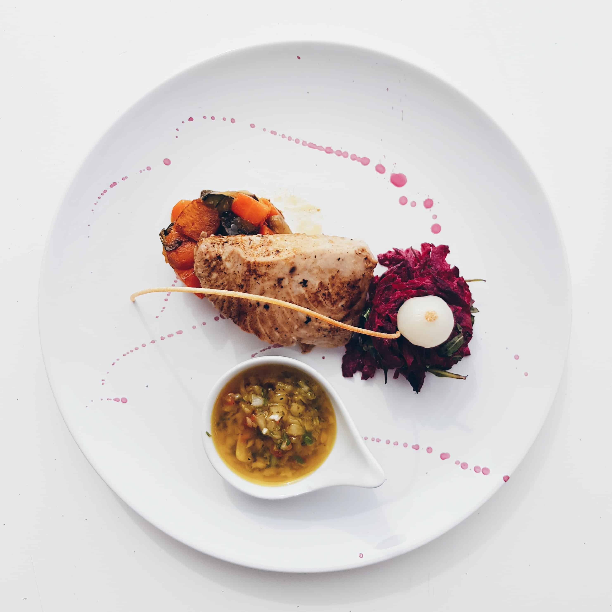
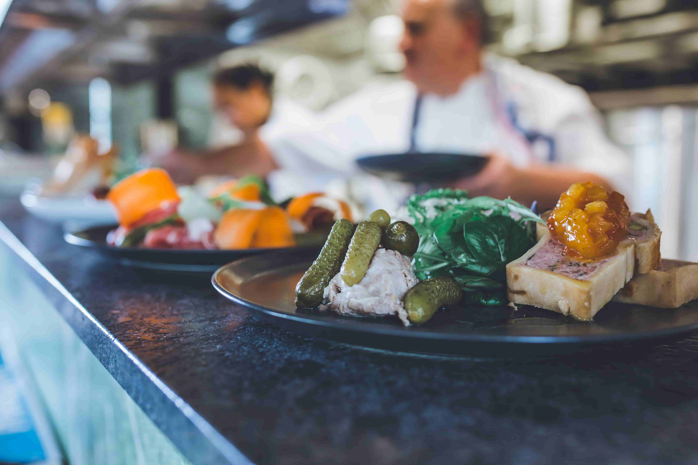
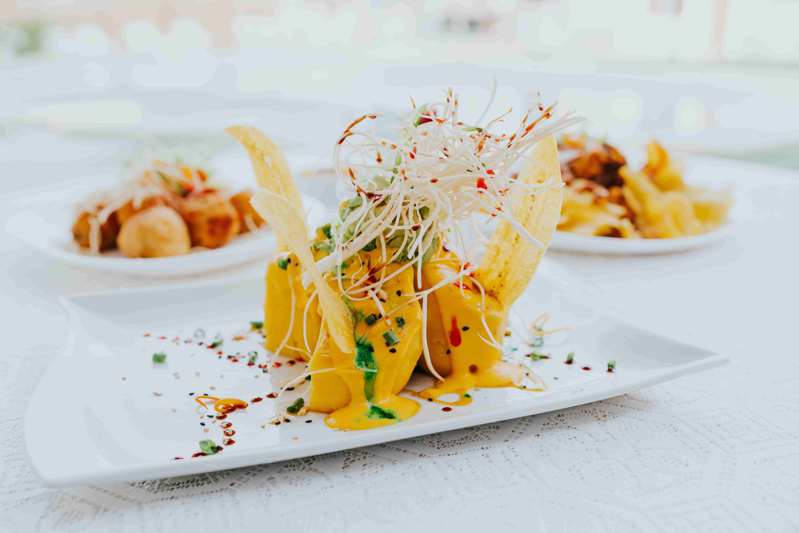

import imageBenjaminRussel from '@/images/team/benjamin-russel.jpg'

export const article = {
    date: '2023-12-08',
    title: "Chef Retard : Épater avec Simplicité, Votre Guide pour une Cuisine Sans Pression",
    description: "Découvrez notre guide pratique pour une cuisine sans pression. Des recettes simples mais créatives, une évasion culinaire, et la fusion des saveurs au rendez-vous. Transformez vos repas en expériences mémorables avec Chef Retard.",
    author: {
        name: 'Pierre Savoureux',
        role: 'Chef Étoilé Rize',
        image: {src: imageBenjaminRussel},
    },
}

export const metadata = {
    title: article.title,
    description: article.description,
    keywords: "Chef Retard, cuisine sans stress, recettes simples, créativité culinaire, évasion, fusion des saveurs, expérience mémorable.",
    twitter: {
        title: article.title,
        description: article.description,
        images: 'https://images.unsplash.com/photo-1700627704834-fe9c4450b169?q=80&w=2970&auto=format&fit=crop&ixlib=rb-4.0.3&ixid=M3wxMjA3fDB8MHxwaG90by1wYWdlfHx8fGVufDB8fHx8fA%3D%3D'
    }
}

# Chef Retard : Épater avec Simplicité, Votre Guide pour une Cuisine Sans Pression

La cuisine devrait être un art accessible à tous, même aux chefs retardataires. Chez Chef Retard, nous croyons en la magie de la simplicité. Découvrez notre guide pour épater sans stresser dans votre cuisine.

## 1. Créativité Instantanée

Soyez prêt à surprendre vos convives sans passer des heures en cuisine. Optez pour des recettes simples mais pleines de saveurs. Notre guide vous dévoilera des astuces pour une créativité instantanée, transformant chaque repas en une expérience culinaire mémorable.

## 2. Évasion Culinaire

Transformez votre cuisine en un lieu d'évasion. Nos conseils vous guideront pour créer une atmosphère relaxante, même lorsque le temps presse. Découvrez comment faire de chaque préparation une échappée culinaire, où le plaisir l'emporte sur le stress.

## 3. Fusion des Saveurs

Explorez l'harmonie des saveurs en mariant des ingrédients simples de manière surprenante. Notre guide vous enseignera l'art de la fusion des saveurs, ajoutant une nouvelle dimension à vos plats sans complication excessive.

En suivant ces conseils, votre cuisine deviendra un lieu où la simplicité rime avec l'élégance. Explorez nos recettes sur Chef Retard pour des idées encore plus délicieuses. Partagez vos moments culinaires sans stress avec la communauté Chef Retard !

---

La cuisine devrait être une aventure agréable, même pour ceux qui préfèrent prendre leur temps. Chez Chef Retard, nous mettons l'accent sur la magie de la simplicité, montrant que des plats délicieux peuvent être préparés sans stress inutile. Notre guide propose une approche détendue pour épater vos convives et faire de chaque repas une expérience culinaire inoubliable.

La créativité instantanée est la clé pour surprendre sans effort. Choisissez des recettes simples qui utilisent des ingrédients de base mais qui sont pleines de saveurs. Notre guide vous livre des astuces pour infuser une créativité instantanée dans vos plats, transformant chaque repas en une véritable œuvre d'art gustative.

Transformez votre cuisine en un lieu d'évasion, un sanctuaire où le plaisir l'emporte sur le stress. Nos conseils vous guideront pour créer une atmosphère relaxante, même lorsque le temps est compté. Faites de chaque préparation une échappée culinaire, où le simple fait de cuisiner devient une source de joie et de satisfaction.

Explorez l'harmonie des saveurs en mariant des ingrédients simples de manière surprenante. Notre guide sur la fusion des saveurs vous apprendra comment jouer avec les combinaisons pour ajouter une nouvelle dimension à vos plats. La fusion des saveurs devient un art accessible, permettant à chaque chef retardataire de créer des expériences culinaires sophistiquées sans complication excessive.

Avec Chef Retard, votre cuisine devient un lieu où la simplicité rime avec l'élégance, où la créativité instantanée est la norme, et où l'évasion culinaire est à portée de main. Explorez nos recettes pour des idées encore plus délicieuses et partagez vos moments culinaires sans stress avec la communauté Chef Retard ! Chaque plat devient une déclaration de créativité et de plaisir, prouvant que la cuisine peut être à la fois simple et époustouflante.
