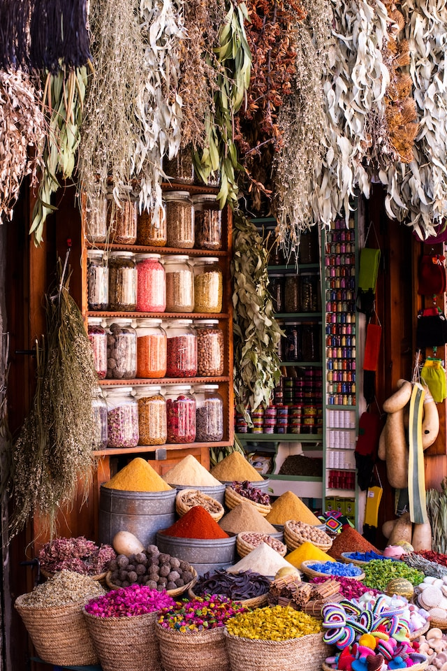
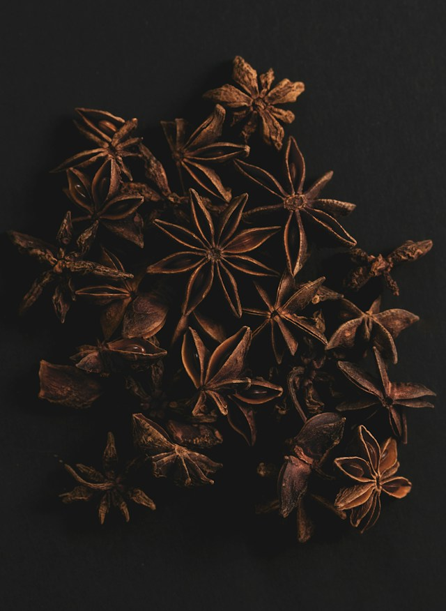

import imageBlakeReid from '@/images/team/blake-reid.jpg'

export const article = {
    date: '2023-12-10',
    title: "Chef Retard : Exploration Infinita des Saveurs",
    description: "Plongez dans l'exploration infinie des saveurs avec Chef Retard. Découvrez l'art des épices, la fusion des cultures et l'expérimentation sucrée-salée pour une expérience culinaire sans limites. Explorez les saveurs avec Chef Retard.",
    author: {
        name: 'Margot Retard',
        role: 'Chef retard Pâtissier',
        image: {src: imageBlakeReid},
    },
}

export const metadata = {
    title: article.title,
    description: article.description,
    keywords: "Chef Retard, exploration des saveurs, épices du monde, fusion des cultures, expérimentation sucrée-salée, créativité culinaire, expérience gustative unique.",
    openGraph: {
        title: article.title,
        description: article.description,
        images: 'https://images.unsplash.com/photo-1700627704834-fe9c4450b169?q=80&w=2970&auto=format&fit=crop&ixlib=rb-4.0.3&ixid=M3wxMjA3fDB8MHxwaG90by1wYWdlfHx8fGVufDB8fHx8fA%3D%3D'
    }
}

# Chef Retard : Exploration Infinis des Saveurs de chef retard

La cuisine devrait être une aventure sans fin pour les amateurs de bonnes saveurs. Chez Chef Retard, nous croyons en l'exploration infinie des saveurs, où chaque plat raconte une histoire gustative unique. Découvrez notre guide pour élargir vos horizons culinaires avec aisance.

## 1. Découverte des Épices

Explorez le monde des épices et découvrez comment elles peuvent transformer vos plats simples en festins exotiques. Notre guide vous conduira à travers une exploration sensorielle, vous enseignant l'art subtil de l'utilisation des épices pour stimuler vos papilles.

## 2. Fusion des Cultures

La cuisine est une célébration de la diversité culturelle. Apprenez à fusionner les saveurs de différentes cultures pour créer des plats uniques. Notre guide vous guidera à travers un voyage culinaire où l'harmonie des saveurs transcende les frontières.

## 3. Expérimentation Sucrée-Salée

Osez l'expérimentation avec des combinaisons sucrées-salées. Découvrez comment jouer avec les contrastes de saveurs peut élever vos plats à un niveau supérieur. Notre guide vous offre des astuces pour maîtriser l'art délicat de l'équilibre sucré-salé.

En suivant ces conseils, votre cuisine deviendra une toile infinie de saveurs à explorer. Consultez nos recettes sur Chef Retard pour des idées encore plus créatives. Partagez vos découvertes culinaires avec la communauté gourmande !

---

L'exploration infinie des saveurs est une invitation à repousser les limites de votre palais et à découvrir des horizons gustatifs nouveaux et passionnants. Chef Retard vous guide dans cette aventure sensorielle, mettant l'accent sur trois aspects clés pour éveiller vos papilles.

La première étape de cette exploration consiste à découvrir les épices. Ces joyaux aromatiques du monde culinaire peuvent métamorphoser des plats simples en expériences sensorielles riches et complexes. Que ce soit le piquant du poivre noir, la chaleur du gingembre ou la douceur de la cannelle, chaque épice a une histoire à raconter. Notre guide dévoile les secrets de l'utilisation judicieuse des épices, vous permettant de composer des plats qui transportent vos sens vers des contrées lointaines.

La fusion des cultures est une célébration de la diversité culinaire. Explorez les saveurs distinctes de différentes cuisines du monde et apprenez à les marier pour créer des plats qui transcendent les frontières géographiques. L'harmonie des saveurs devient un langage universel, et chaque bouchée devient une célébration de la richesse de la diversité culturelle.

L'expérimentation sucrée-salée offre une autre dimension excitante à votre exploration culinaire. Osez combiner des saveurs opposées, créant des équilibres délicats qui stimulent le palais. Les contrastes entre le sucré et le salé peuvent révéler de nouvelles dimensions de plaisir gustatif. Notre guide vous accompagne dans cette aventure, offrant des conseils pratiques pour maîtriser cette danse délicate entre les saveurs.

Avec Chef Retard, votre cuisine devient une toile infinie de saveurs à explorer. Parcourez nos recettes pour des idées encore plus créatives et laissez-vous inspirer par les découvertes culinaires partagées par notre communauté gourmande. Chaque plat que vous créez devient une pièce unique dans le tableau de votre aventure culinaire, une expérience gustative qui éveille les sens et nourrit l'âme.
