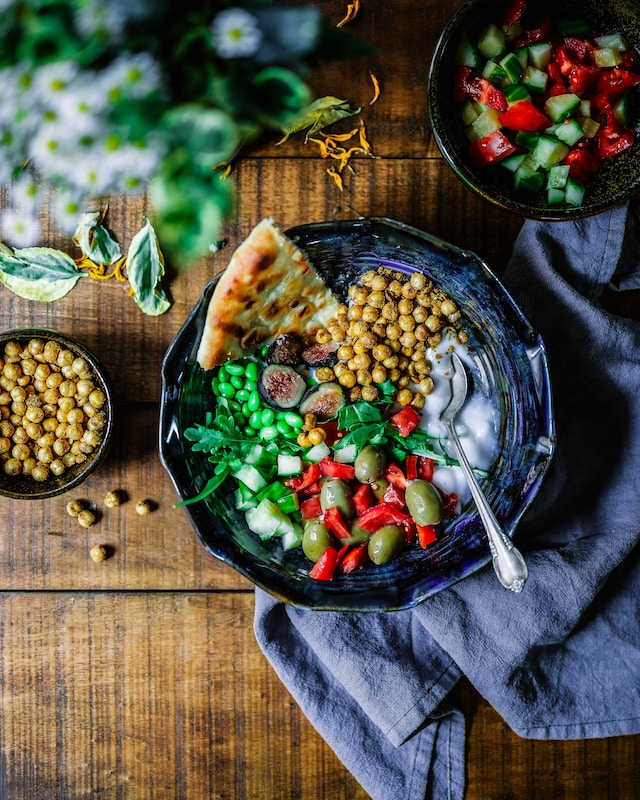
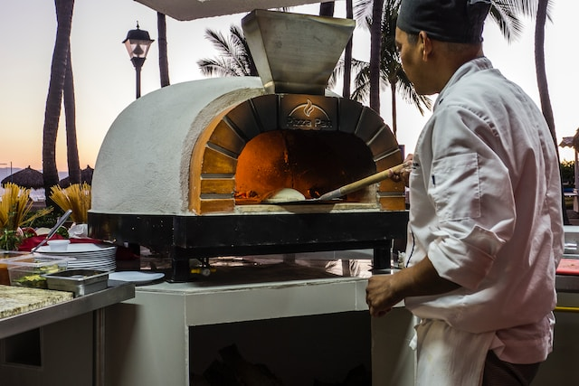

import imageJeffreyWebb from '@/images/team/jeffrey-webb.jpg'

export const article = {
    date: '2023-12-10',
    title: "Chef Retard : La Magie de la Cuisson Lente",
    description: "Découvrez la magie de la cuisson lente avec notre guide. Des plats qui célèbrent la douceur du temps, une préparation relaxante, et l'équilibre des saveurs pour une expérience culinaire inoubliable. Explorez la lenteur avec Chef Retard.",
    author: {
        name: 'Pierre Retard',
        role: 'Chef retard Pâtissier',
        image: {src: imageJeffreyWebb},
    },
}

export const metadata = {
    title: article.title,
    description: article.description,
    keywords: "Chef Retard, cuisson lente, recettes savoureuses, préparation relaxante, équilibre des saveurs, expérience culinaire détendue.",
    openGraph: {
        siteName : 'Chef Retard',
        title: article.title,
        description: article.description,
        images: 'https://images.unsplash.com/photo-1700627704834-fe9c4450b169?q=80&w=2970&auto=format&fit=crop&ixlib=rb-4.0.3&ixid=M3wxMjA3fDB8MHxwaG90by1wYWdlfHx8fGVufDB8fHx8fA%3D%3D'
    }
}

# Chef Retard : La Magie de la Cuisson Lente

La cuisine lente peut être une véritable révélation pour ceux qui cherchent à savourer chaque instant. Chez Chef Retard, nous explorons la magie de la cuisson lente, transformant les plats simples en délices inoubliables. Suivez notre guide pour une expérience culinaire riche en saveurs et en détente.

## 1. Douceur du Temps

Apprenez à apprécier la douceur du temps en cuisinant lentement. Notre guide vous montrera comment les plats mijotés lentement révèlent des saveurs profondes et des textures tendres. Découvrez l'art de la patience dans votre cuisine.

## 2. Préparation Relaxante

La cuisson lente offre une préparation relaxante. Évadez-vous du stress quotidien en prenant le temps de préparer des repas délicieux. Notre guide vous guidera à travers des recettes qui apaisent l'esprit tout en régalant les papilles.

## 3. Équilibre des Saveurs

Explorez l'équilibre des saveurs avec des ingrédients simples. Notre guide vous enseignera comment chaque ingrédient contribue à créer un équilibre parfait dans vos plats. Découvrez comment la cuisson lente peut sublimer même les ingrédients les plus modestes.

Transformez votre cuisine en un sanctuaire de calme avec la magie de la cuisson lente. Explorez nos recettes sur Chef Retard pour des idées qui célèbrent la lenteur. Partagez vos moments culinaires avec nous !

---

La cuisson lente transcende le simple acte de préparer des repas ; elle offre une expérience sensorielle et méditative. En prenant le temps de cuisiner lentement, vous permettez aux saveurs de se mêler et de se développer, créant ainsi des plats qui évoquent des souvenirs et suscitent des émotions.

Lorsque vous adoptez la cuisson lente, chaque ingrédient devient une note dans une symphonie gustative. Les arômes se marient subtilement, les textures se transforment, et chaque bouchée devient une aventure culinaire. Chef Retard vous guide dans cet art de la patience, vous montrant comment créer des plats qui réconfortent non seulement votre estomac mais aussi votre âme.

La douceur du temps se reflète dans chaque plat préparé lentement. Imaginez un ragoût mijotant doucement sur le feu, les saveurs s'entrelaçant pour créer une expérience gustative incomparable. Les viandes deviennent tendres, les légumes absorbent les arômes, et le résultat est une symphonie de saveurs harmonieuses.

La préparation relaxante associée à la cuisson lente offre également une échappatoire bienvenue au stress quotidien. Prenez le temps de couper minutieusement les ingrédients, de mélanger les épices avec soin, et de créer des plats qui demandent une attention aimante. La cuisine devient un rituel apaisant, vous permettant de vous reconnecter avec chaque étape du processus culinaire.

L'équilibre des saveurs est une autre dimension fascinante de la cuisson lente. En utilisant des ingrédients simples mais de qualité, vous apprendrez à apprécier la contribution de chaque élément à l'ensemble. Les plats équilibrés stimulent tous les sens, créant une expérience gustative complète et satisfaisante.

Chef Retard vous encourage à embrasser la magie de la cuisson lente. Explorez nos recettes conçues pour célébrer la lenteur, que ce soit avec des mijotés réconfortants, des plats braisés ou des desserts qui prennent le temps nécessaire pour se perfectionner. Partagez vos moments culinaires avec nous et faites de la cuisson lente une partie précieuse de votre voyage gastronomique. La magie opère lorsque vous ralentissez, laissant chaque ingrédient raconter son histoire et chaque plat devenir une création mémorable.

