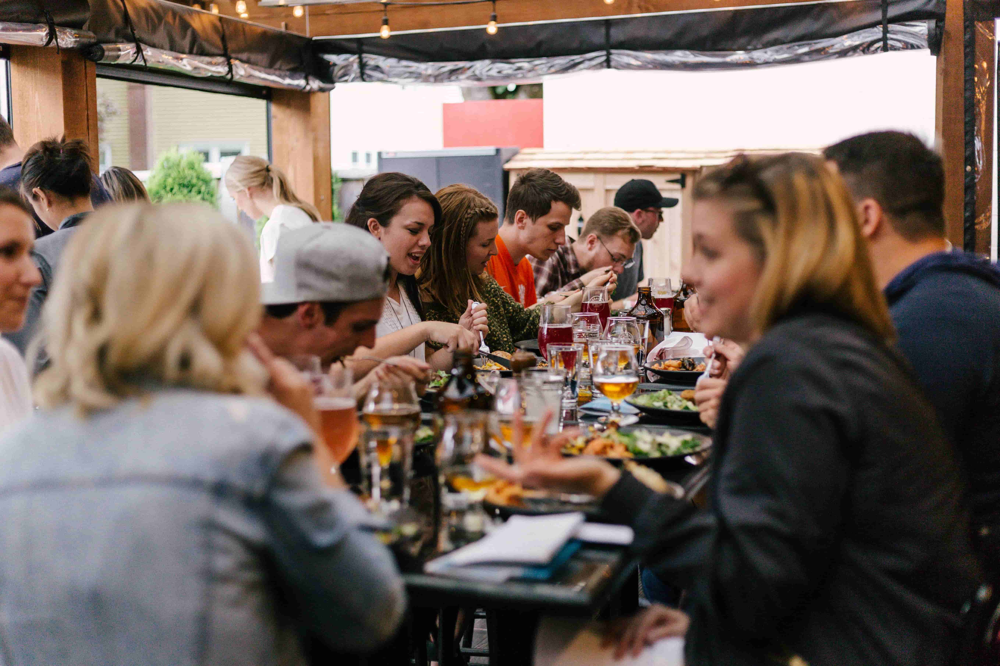

import imageChelseaHagon from '@/images/team/chelsea-hagon.jpg'

export const article = {
    date: '2023-12-08',
    title: "Cuisine en Famille : Recettes et Conseils pour des Moments Mémorables",
    description: "Plongez dans l'univers de la cuisine en famille avec nos recettes et conseils sur Chef Retard. Découvrez des plats adaptés à tous les âges, des activités ludiques en cuisine, et créez des souvenirs mémorables autour de la table. Établissez des traditions culinaires en famille.",
    author: {
        name: 'Isabelle Cuisinier',
        role: 'Chef Exécutif',
        image: {src: imageChelseaHagon},
    },
}

export const metadata = {
    title: article.title,
    description: article.description,
    keywords: "Cuisine en Famille, Recettes, Conseils, Moments Mémorables, Chef Retard, Cuisine adaptée à tous les âges, Activités ludiques en cuisine, Souvenirs autour de la table, Traditions culinaires en famille",
    twitter: {
        title: article.title,
        description: article.description,
    }
}

# Cuisine en Famille : Recettes et Conseils pour des Moments Mémorables

La cuisine en famille est bien plus qu'une simple préparation de repas, c'est une aventure partagée, une occasion de créer des souvenirs inoubliables. Sur Chef Retard, plongez dans cet univers chaleureux avec nos recettes spécialement conçues pour tous les âges et nos conseils pour des moments mémorables en famille.

## 1. Plaisir Intergénérationnel

Découvrez des recettes qui transcendent les générations. Des grands-parents aux plus jeunes, nos plats sont conçus pour plaire à tous les membres de la famille. Explorez un monde de saveurs qui rassemble petits et grands autour de la table.

## 2. Activités Ludiques en Cuisine

Transformez la cuisine en terrain de jeu créatif. Nos activités ludiques en cuisine sont conçues pour divertir tout en cuisinant. Des décorations amusantes aux formes originales, engagez toute la famille dans le processus de création.

## 3. Création de Souvenirs

Créez des souvenirs mémorables autour de la table. Partagez des repas spéciaux, capturez ces moments en famille avec des photos et établissez des traditions culinaires qui perdureront. Notre guide vous accompagne dans la création d'expériences culinaires inoubliables.

Plongez dans notre univers de cuisine en famille sur Chef Retard et créez des moments mémorables qui resteront gravés dans le cœur de votre famille. Établissez des traditions culinaires qui transcendent le temps et partagez l'amour à travers chaque délicieuse bouchée.