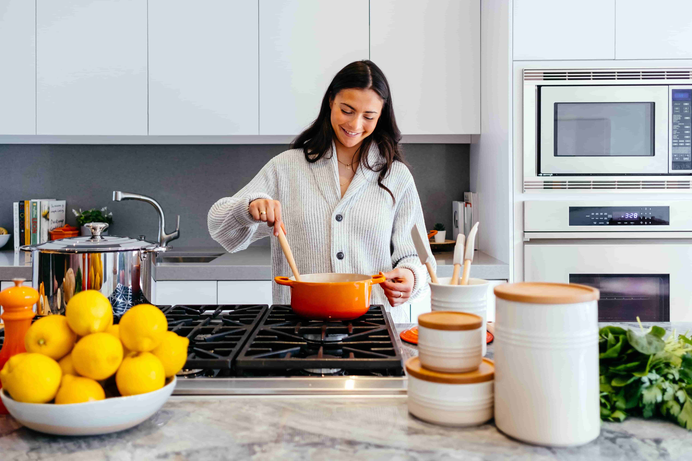
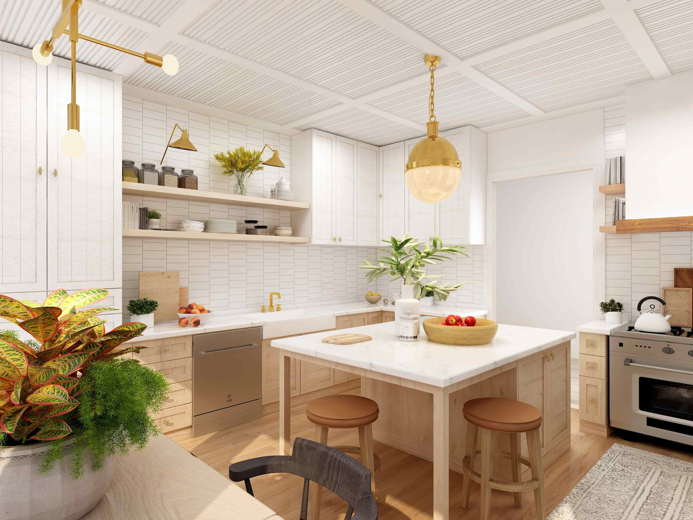
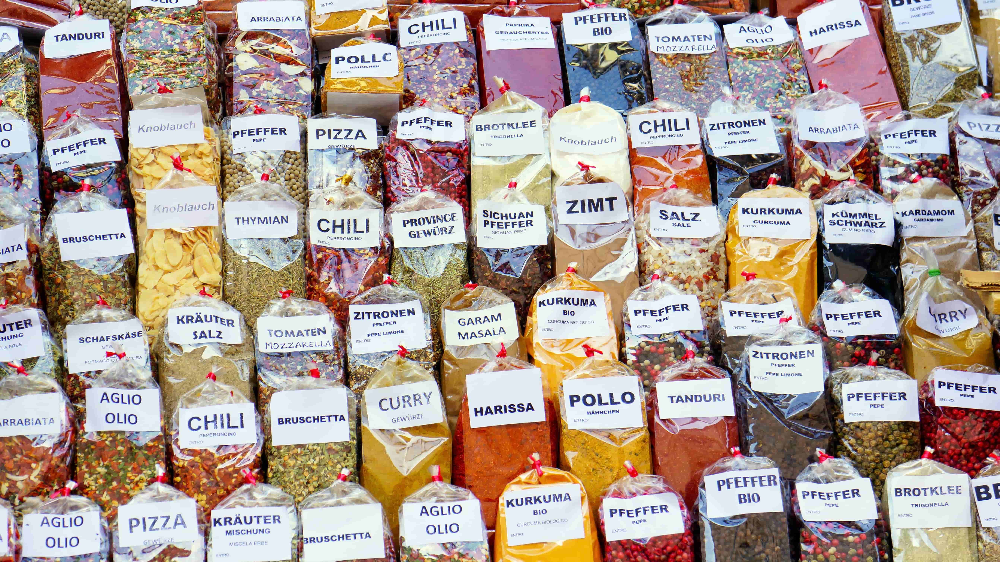

import imageWhitneyFrancis from '@/images/team/whitney-francis.jpg'

export const article = {
    date: '2023-12-08',
    title: 'Cuisine Relaxante : Un Guide Complet pour Éliminer le Stress',
    description:
        'Découvrez notre guide complet pour cuisiner sans stress sur Chef Retard. Apprenez à planifier, à organiser votre espace de travail, et à savourer chaque moment en cuisine. Transformez votre expérience culinaire avec nos conseils pratiques.',
    author: {
        name: 'Olivier Gourmand',
        role: 'Chef de Famille et Cuisinier Créatif',
        image: {src: imageWhitneyFrancis},
    },
}

export const metadata = {
    title: article.title,
    description: article.description,
    keywords: "Cuisine Relaxante, Guide Complet, Éliminer le Stress, Chef Retard, Cuisiner sans stress, Planification, Organisation de l'espace de travail, Savourer chaque moment, Expérience culinaire, Conseils pratiques",
    twitter: {
        title: article.title,
        description: article.description,
        images: 'https://images.unsplash.com/photo-1700627704834-fe9c4450b169?q=80&w=2970&auto=format&fit=crop&ixlib=rb-4.0.3&ixid=M3wxMjA3fDB8MHxwaG90by1wYWdlfHx8fGVufDB8fHx8fA%3D%3D'
    }
}

# Cuisine Relaxante : Un Guide Complet pour Éliminer le Stress

La cuisine devrait être un lieu de créativité et de détente, mais souvent, le stress s'invite entre les ingrédients. Chez Chef Retard, nous croyons que chaque moment en cuisine devrait être une expérience agréable. Voici notre guide complet pour éliminer le stress de votre routine culinaire.

## 1. Organisation Sans Effort

La clé d'une cuisine relaxante est une organisation sans effort. Évitez les longs noms de plats compliqués et optez pour des abréviations simples. Un plat de pâtes carbonara? Nommez-le "pc" et gagnez du temps précieux sans sacrifier la saveur.

## 2. Priorité à la Détente

Lorsque vous travaillez dans une cuisine bien organisée, vous libérez de l'espace mental pour savourer chaque étape. Notre guide vous apprendra à hiérarchiser la détente, en faisant de chaque repas une expérience plaisante plutôt qu'une corvée stressante.

## 3. Langues du Monde

Si vous faites partie d'une équipe mondiale, pourquoi limiter les noms de vos plats à une seule langue? Encouragez la diversité linguistique dans votre cuisine. Créez un index multilingue pour que chacun puisse contribuer dans sa langue maternelle, favorisant ainsi l'inclusion et la compréhension.

En suivant ces conseils pratiques, vous transformerez votre cuisine en un havre de paix culinaire. N'hésitez pas à explorer nos recettes relaxantes sur Chef Retard et à partager vos propres astuces pour une expérience culinaire sans stress.