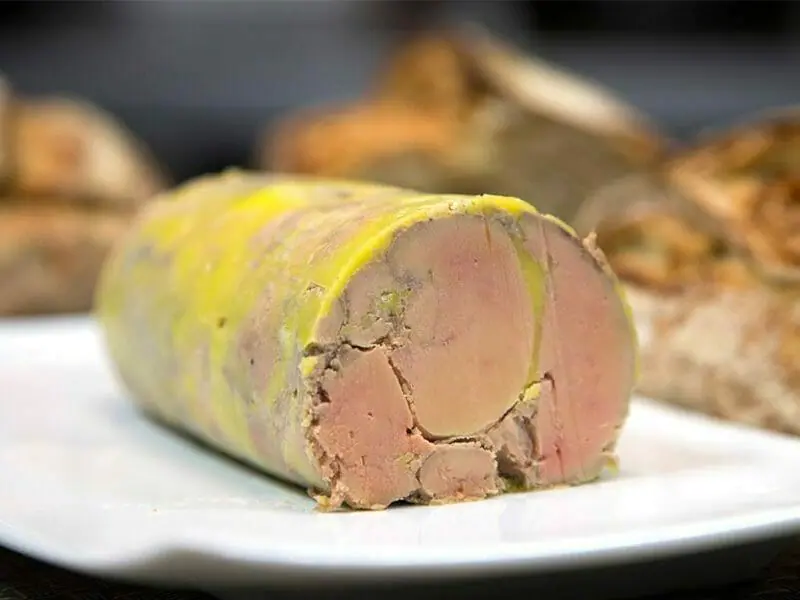
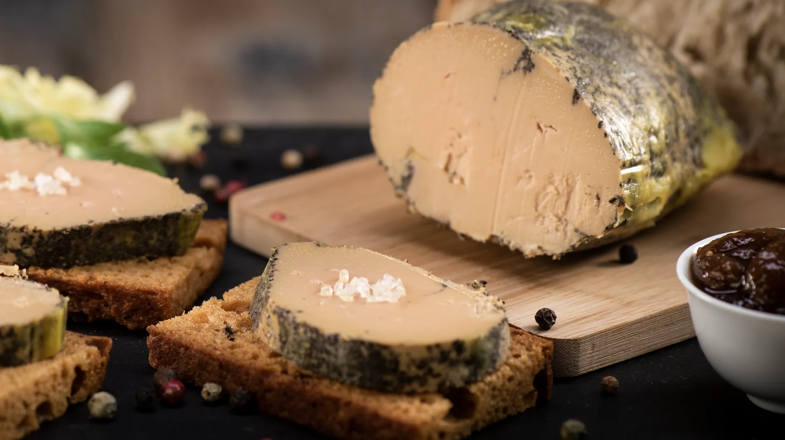
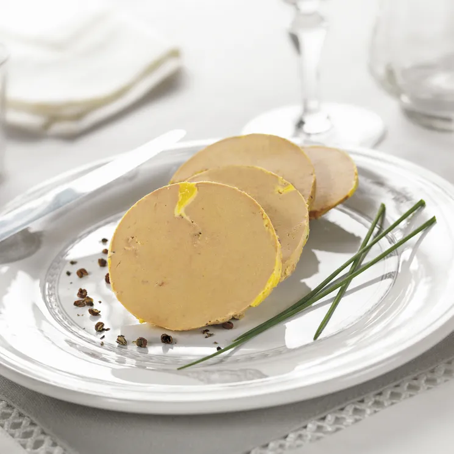

import imageWhitneyFrancis from '@/images/team/whitney-francis.jpg'

export const article = {
    date: '2023-12-12',
    title: 'Découvrez l\'Excellence Culinaire avec Chef Retard : Conseils et Recette de Foie Gras',
    description:
        'Explorez le monde du foie gras avec Chef Retard. Des conseils précieux pour choisir, conserver et servir le foie gras, accompagnés d\'une recette exquise de foie gras poêlé aux fruits rouges. Élevez votre expérience culinaire avec nos astuces gastronomiques.',
    author: {
        name: 'Éric Pras',
        role: 'Chef Retard Créatif',
        image: {src: imageWhitneyFrancis},
    },
}

export const metadata = {
    title: article.title,
    description: article.description,
    keywords: "foie gras, Chef Retard, conseils culinaires, recette foie gras, excellence gastronomique, fruits rouges, délicatesse française, savoir-faire culinaire, astuces de cuisine, expérience culinaire.",
    twitter: {
        title: article.title,
        description: article.description,
        images: 'https://images.unsplash.com/photo-1700627704834-fe9c4450b169?q=80&w=2970&auto=format&fit=crop&ixlib=rb-4.0.3&ixid=M3wxMjA3fDB8MHxwaG90by1wYWdlfHx8fGVufDB8fHx8fA%3D%3D'
    }
}

# Découverte du Foie Gras : Conseils et Recette Exquise

Le foie gras, trésor de la gastronomie française, est une délicatesse qui séduit les palais les plus exigeants. Découvrez avec Chef Retard quelques conseils essentiels et une recette exquise pour apprécier pleinement cette merveille culinaire.

## Conseils pour Apprécier le Foie Gras

### 1. Sélection du Foie Gras

Lors de l'achat de foie gras, privilégiez la qualité. Optez pour du foie gras frais de canard ou d'oie, de préférence issu de fermes réputées pour leur éthique et leurs pratiques responsables.

### 2. Conservation Appropriée

Le foie gras doit être conservé au réfrigérateur avant sa préparation. Conservez-le dans son emballage d'origine et veillez à respecter la date limite de consommation.

### 3. Température de Service

Sortez le foie gras du réfrigérateur environ 15 à 20 minutes avant de le servir. Il doit être dégusté frais, mais pas trop froid, pour libérer pleinement ses arômes.

## Recette Exquise : Foie Gras Poêlé aux Fruits Rouges

### Ingrédients :
- Foie gras frais (en tranches)
- Fruits rouges frais (framboises, mûres, groseilles)
- Vinaigre balsamique
- Sucre
- Sel, poivre

### Instructions :
1. Assaisonnez les tranches de foie gras avec du sel et du poivre.
2. Dans une poêle chaude, faites cuire le foie gras pendant 1 à 2 minutes de chaque côté jusqu'à ce qu'il soit bien doré.
3. Dans une casserole, faites chauffer une poignée de fruits rouges avec une cuillère à soupe de sucre et une cuillère à soupe de vinaigre balsamique jusqu'à obtention d'une compote.
4. Disposez les tranches de foie gras poêlées sur des assiettes et nappez-les de la compote de fruits rouges.

Servez immédiatement ce foie gras poêlé aux fruits rouges pour une explosion de saveurs en bouche. Accompagnez-le d'un vin blanc moelleux pour compléter cette expérience gastronomique.

En suivant ces conseils et en essayant cette recette exquise, vous ferez du foie gras un plat divin qui ravira vos papilles et impressionnera vos convives. Chef Retard vous souhaite un voyage culinaire mémorable avec le foie gras !
