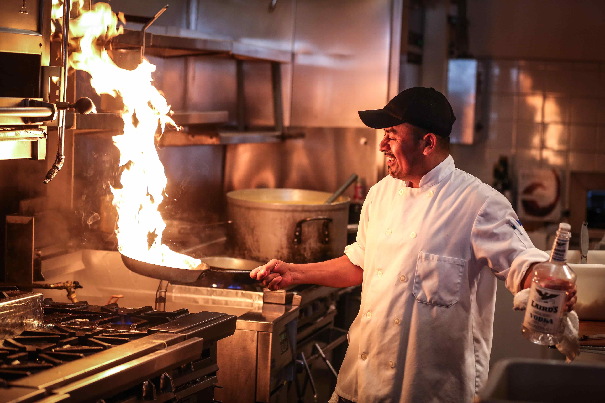

import imageChelseaHagon from '@/images/team/chelsea-hagon.jpg'

export const article = {
    date: '2023-12-08',
    title: "Gestion du Temps en Cuisine : Astuces Inspirées des Chefs",
    description: "Explorez des techniques de gestion du temps en cuisine inspirées des chefs sur Chef Retard. Maximisez votre efficacité, minimisez le stress, et découvrez comment les professionnels font face aux défis du temps en cuisine. Transformez-vous en chef du temps.",
    author: {
        name: 'Pierre Savoureux',
        role: 'Chef Étoilé Rize',
        image: {src: imageChelseaHagon},
    },
}

export const metadata = {
    title: article.title,
    description: article.description,
    keywords: "Gestion du temps en cuisine, Astuces de chefs, Efficacité en cuisine, Minimiser le stress culinaire, Techniques de planification, Optimisation du flux de travail, Préparation rapide en cuisine, Organisation ergonomique, Cuisine professionnelle, Chef du temps, Conseils pour cuisiner rapidement, Maximiser l'efficacité en cuisine, Gestion du temps culinaire, Cuisine sans stress, Astuces culinaires inspirées des professionnels, Planification précise en cuisine, Techniques de préparation rapide, Organisation ergonomique en cuisine, Optimisation du temps en cuisine, Chef Retard astuces temporelles",
    openGraph: {
        title: article.title,
        description: article.description,
        images: 'https://images.unsplash.com/photo-1700627704834-fe9c4450b169?q=80&w=2970&auto=format&fit=crop&ixlib=rb-4.0.3&ixid=M3wxMjA3fDB8MHxwaG90by1wYWdlfHx8fGVufDB8fHx8fA%3D%3D'
    }
}

# Gestion du Temps en Cuisine : Astuces Inspirées des Chefs

La gestion du temps en cuisine est cruciale pour toute personne passionnée de gastronomie. Sur Chef Retard, nous vous dévoilons des astuces exclusives inspirées par les chefs eux-mêmes, afin d'optimiser votre efficacité en cuisine tout en minimisant le stress.

## 1. Planification Précise

Les chefs chevronnés planifient chaque étape de leur préparation. Apprenez à établir une liste de tâches précise, à anticiper les temps de cuisson et à optimiser le flux de travail. Notre guide détaillé vous aidera à planifier comme un chef, vous permettant de maximiser chaque minute en cuisine.

## 2. Techniques de Préparation Rapide

Les professionnels savent comment gagner du temps sans compromettre la qualité. Découvrez des techniques de découpe efficaces, des méthodes de préparation rapide et des astuces pour accélérer la mise en place. Transformez votre cuisine en un espace où le temps est votre allié.

## 3. Organisation Ergonomique

Une cuisine bien organisée est la clé d'une gestion du temps efficace. Explorez des astuces d'organisation ergonomique pour optimiser votre espace de travail. De la disposition des ustensiles à l'agencement des ingrédients, nos conseils vous aideront à maîtriser le temps dans une cuisine bien orchestrée.

En suivant ces astuces inspirées des chefs sur Chef Retard, vous transformerez votre expérience culinaire en une aventure temporelle fluide. Explorez nos ressources pour devenir un véritable chef du temps en cuisine et faites de chaque repas une victoire contre la montre.

---

La gestion du temps en cuisine devient un art avec les astuces inspirées des chefs disponibles sur Chef Retard. Ces conseils exclusifs vous permettront d'optimiser votre efficacité en cuisine, tout en vous aidant à minimiser le stress associé à la préparation des repas.

Les chefs chevronnés planifient méticuleusement chaque étape de leur préparation. Apprenez à établir une liste de tâches précise, à anticiper les temps de cuisson et à optimiser le flux de travail. Notre guide détaillé vous guidera pas à pas pour planifier comme un chef, vous permettant de maximiser chaque minute en cuisine.

Les professionnels savent comment gagner du temps sans compromettre la qualité. Découvrez des techniques de découpe efficaces, des méthodes de préparation rapide et des astuces pour accélérer la mise en place. Transformez votre cuisine en un espace où le temps est votre allié, et où chaque geste est un pas de plus vers une cuisine efficace et délicieuse.

Une cuisine bien organisée est la clé d'une gestion du temps réussie. Explorez des astuces d'organisation ergonomique pour optimiser votre espace de travail. De la disposition des ustensiles à l'agencement des ingrédients, nos conseils vous aideront à maîtriser le temps dans une cuisine bien orchestrée. Devenez un véritable chef du temps en cuisine grâce aux ressources de Chef Retard et faites de chaque repas une victoire contre la montre.
