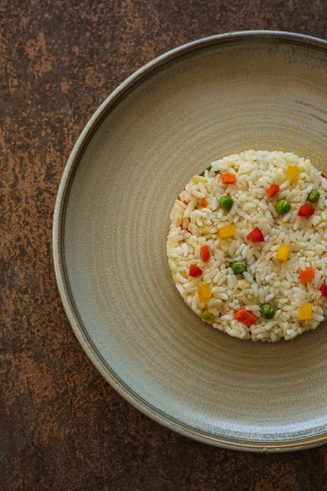

import imageLeonardKrasner from '@/images/team/leonard-krasner.jpg'

export const article = {
    date: '2023-12-19',
    title: "Recette Gourmande : Risotto aux Champignons et Parmesan",
    description: "Découvrez comment préparer un délicieux risotto crémeux aux champignons et parmesan. Une recette simple qui éveillera vos papilles avec chaque bouchée.",
    author: {
        name: 'Pierre Savoureux',
        role: 'Chef Étoilé Rize',
        image: {src: imageLeonardKrasner},
    },
}

export const metadata = {
    title: article.title,
    description: article.description,
    keywords: "chef retard, recette risotto, cuisine italienne, champignons, parmesan, cuisine gourmande",
    openGraph: {
        siteName : 'Chef Retard',
        title: article.title,
        description: article.description,
        images: 'https://images.unsplash.com/photo-1700627704834-fe9c4450b169?q=80&w=2970&auto=format&fit=crop&ixlib=rb-4.0.3&ixid=M3wxMjA3fDB8MHxwaG90by1wYWdlfHx8fGVufDB8fHx8fA%3D%3D'
    }
}

# Risotto aux Champignons et Parmesan

Le risotto est un plat emblématique de la cuisine italienne, et cette recette délicieuse ajoute une touche gourmande avec des champignons savoureux et du parmesan fondant. Suivez nos étapes simples pour créer un risotto crémeux qui éveillera vos papilles.

## Ingrédients :

- 1 tasse de riz Arborio
- 200g de champignons frais, tranchés
- 1 oignon, finement haché
- 2 gousses d'ail, émincées
- 1/2 tasse de vin blanc sec
- 4 tasses de bouillon de légumes chaud
- 1/2 tasse de parmesan râpé
- 2 cuillères à soupe de beurre
- Sel et poivre noir, selon le goût
- Persil frais haché pour la garniture

## Instructions :

1. Dans une grande poêle, faites fondre 1 cuillère à soupe de beurre à feu moyen. Ajoutez les champignons et faites-les sauter jusqu'à ce qu'ils soient dorés. Retirez-les de la poêle et réservez.

2. Dans la même poêle, ajoutez le reste du beurre et faites revenir l'oignon jusqu'à ce qu'il soit transparent. Ajoutez l'ail et le riz Arborio, en remuant pour enrober le riz de beurre.

3. Versez le vin blanc dans la poêle et remuez jusqu'à ce qu'il soit presque évaporé. Ajoutez une louche de bouillon chaud et remuez jusqu'à absorption.

4. Continuez à ajouter le bouillon, une louche à la fois, en remuant constamment jusqu'à ce que le riz soit crémeux et cuit al dente.

5. Ajoutez les champignons sautés et le parmesan râpé. Remuez bien et assaisonnez avec du sel et du poivre selon votre goût.

6. Retirez du feu et laissez reposer pendant quelques minutes. Saupoudrez de persil frais haché avant de servir.

Servez le risotto aux champignons et parmesan chaud, garni de plus de parmesan si désiré. Savourez chaque cuillère de cette délicieuse création gourmande. Bon appétit !